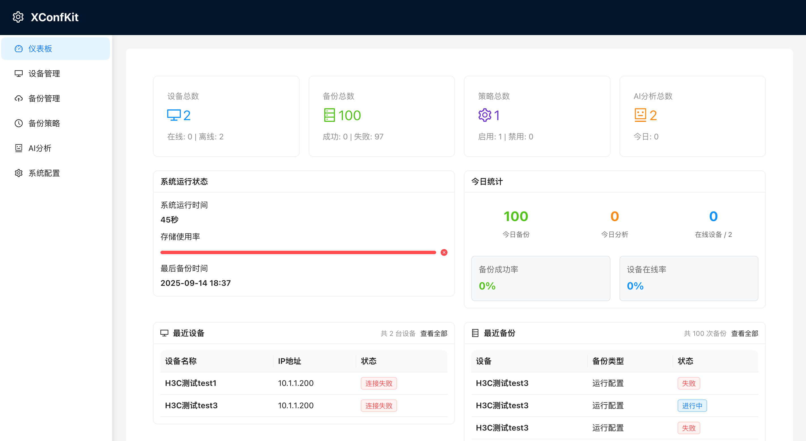
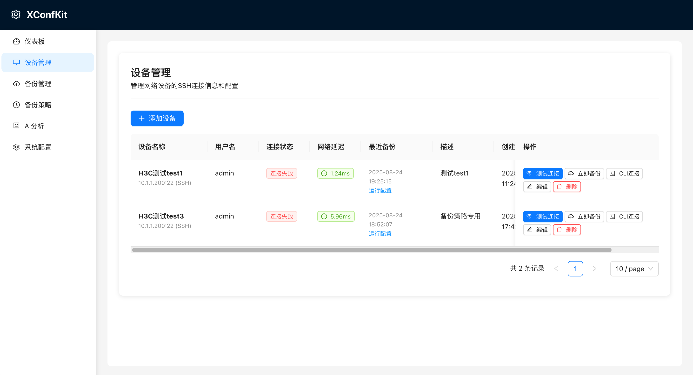
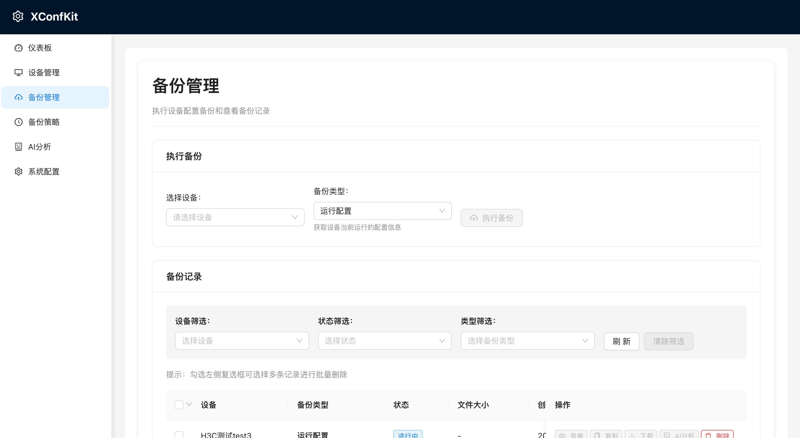
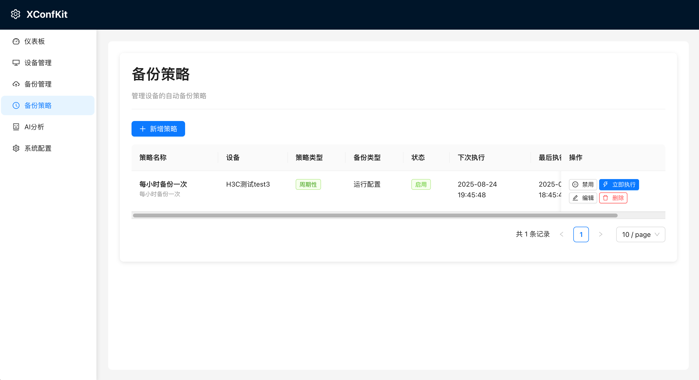
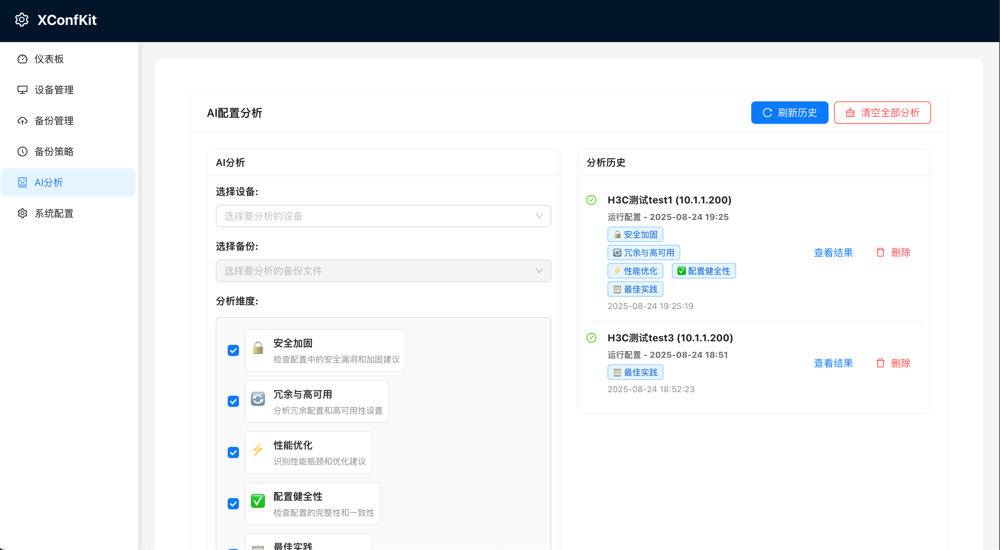
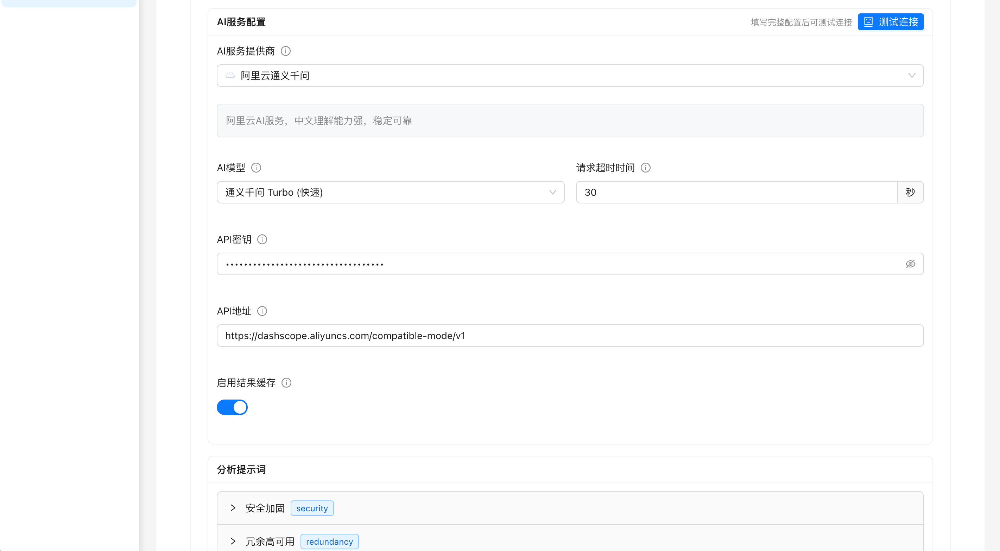

# XConfKit - 网络设备配置备份管理系统

<div align="center">


一个功能完整的网络设备配置备份管理系统，支持SSH连接、自动备份、策略调度等功能。

[](LICENSE)
[](https://python.org)
[](https://nodejs.org)
[](README.md)

</div>

## 📋 功能特性

### 系统界面展示

<div align="center">

#### 🏠 系统主页


#### 🔧 设备管理


#### 💾 备份管理


#### ⚙️ 备份策略


#### 🤖 AI配置分析


#### 🔧 系统配置


</div>

### 核心功能
- ✅ **设备管理**: SSH连接支持，设备增删改查，连接测试
- ✅ **备份管理**: 多种配置类型备份，文件下载，记录筛选，批量删除
- ✅ **备份策略**: 一次性/周期性策略，自动调度执行
- ✅ **AI配置分析**: 智能分析网络设备配置，支持多维度分析
- ✅ **系统配置**: 完整的系统参数配置，支持AI服务配置
- ✅ **服务管理**: 健壮的启动/停止/重启脚本

### 技术特性
- ✅ **跨平台支持**: macOS、Ubuntu、CentOS等
- ✅ **一键部署**: 自动化安装脚本
- ✅ **AI集成**: 集成阿里云通义千问AI服务
- ✅ **完整测试**: 单元测试、集成测试、API测试

## 🚀 快速开始

### 1. 克隆项目
```bash
git clone https://github.com/willdom-lee/XConfKit.git
cd XConfKit
```

### 2. 一键启动
```bash
./start_services.sh
```

### 3. 访问系统
- **前端界面**: http://localhost:5174
- **后端API**: http://localhost:8000
- **API文档**: http://localhost:8000/docs

### Ubuntu 系统安装
```bash
./install.sh
```


## 🛠️ 技术栈

- **后端**: FastAPI + SQLAlchemy + Paramiko + SQLite
- **前端**: React + Ant Design + Vite
- **AI服务**: 阿里云通义千问API
- **部署**: 跨平台支持，一键安装脚本

## 🔧 服务管理

```bash
# 启动服务
./start_services.sh

# 停止服务
./stop_services.sh

# 检查状态
./check_status.sh
```

## 📖 使用指南

1. **添加设备**: 在设备管理页面添加网络设备信息
2. **执行备份**: 选择设备和备份类型进行配置备份
3. **创建策略**: 设置自动备份策略和时间
4. **AI分析**: 使用AI分析网络配置，提供优化建议
5. **系统配置**: 配置AI服务参数和系统设置

## 🔌 API文档

启动后端服务后，访问 http://localhost:8000/docs 查看完整的API文档。

## 🧪 测试

```bash
# 运行完整测试套件
python3 run_tests.py

# 运行前端测试
cd frontend && npm test
```

## 🔒 安全特性

- **SSH加密通信**: 所有设备连接使用SSH协议
- **本地数据处理**: 敏感配置数据本地处理
- **API密钥管理**: 安全的密钥存储和管理
- **设备支持**: H3C、Cisco、华为等主流设备

## 📊 系统要求

- **操作系统**: macOS 10.15+, Ubuntu 18.04+, CentOS 7+
- **Python**: 3.8+
- **Node.js**: 16+
- **内存**: 2GB RAM
- **存储**: 1GB 可用空间

## 🚨 故障排除

- **服务启动失败**: 检查端口占用，使用 `./stop_services.sh` 停止服务
- **设备连接失败**: 验证SSH连接信息和网络连通性
- **AI分析失败**: 检查AI服务配置和网络连接
- **查看日志**: `tail -f backend.log` 或 `tail -f frontend.log`

## 🤝 贡献

欢迎提交 Issue 和 Pull Request！

## 📄 许可证

MIT License

---

## ⚠️ 重要说明

**本项目目前处于演示版本状态，请注意以下事项：**

- 🧪 **测试范围有限**: 目前仅在H3C设备上进行过真实测试，其他厂商设备（如Cisco、华为等）的兼容性尚未验证
- 🔧 **功能完整性**: 系统功能仍在开发完善中，可能存在未发现的bug或不稳定因素
- 🚀 **生产环境**: 建议仅在测试环境中使用，生产环境使用前请充分测试
- 📝 **反馈欢迎**: 如发现问题或有改进建议，欢迎提交Issue或Pull Request

**支持的设备类型（理论支持，需实际测试验证）：**
- H3C设备 ✅ (已测试)
- Cisco设备 ⚠️ (理论支持，未测试)
- 华为设备 ⚠️ (理论支持，未测试)
- 其他SSH设备 ⚠️ (理论支持，未测试)

## 🚨 免责声明

**使用本软件前，请仔细阅读以下免责声明：**

- **网络安全**: 本软件涉及网络设备配置备份，可能对网络设备进行SSH连接和配置操作
- **数据安全**: 使用本软件可能涉及敏感网络配置数据的存储和传输
- **设备安全**: 不正确的配置操作可能导致网络设备故障或安全漏洞
- **系统安全**: 本软件可能存在未知的安全漏洞，可能被恶意利用

**作者和贡献者明确声明：**
- ❌ **不承担任何责任**: 对于因使用本软件而导致的任何直接、间接、偶然、特殊或后果性损害
- ❌ **不保证安全性**: 不保证本软件的安全性、可靠性或适用性
- ❌ **不保证兼容性**: 不保证与所有网络设备的兼容性
- ❌ **不保证稳定性**: 不保证软件运行的稳定性和无错误性

**强烈建议用户：**
- 🔒 **仅在隔离的测试环境中使用**
- 🔐 **确保网络设备的安全配置**
- 📋 **定期备份重要配置**
- 🛡️ **使用防火墙和访问控制**
- ⚖️ **遵守相关法律法规**
- 👥 **由专业网络管理员操作**

**📋 详细免责声明请查看**: [DISCLAIMER.md](DISCLAIMER.md)

---

**最后更新**: 2025年9月14日  
**版本**: 1.0.0-demo  
**状态**: 演示版本，功能基本完整，建议测试环境使用  
**测试状态**: 仅在H3C设备上验证，其他设备兼容性待测试
